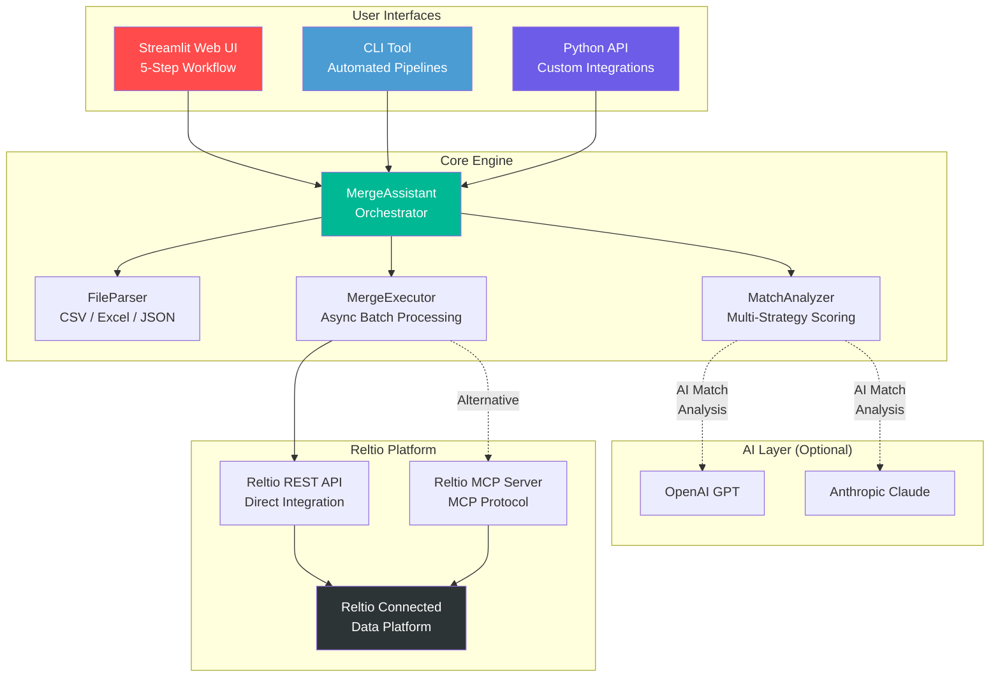
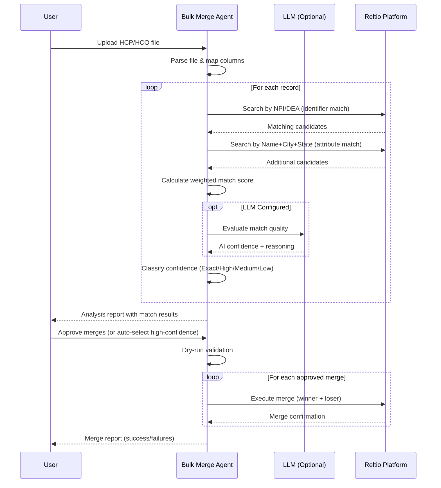
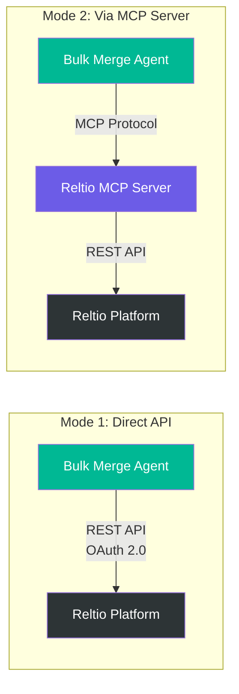
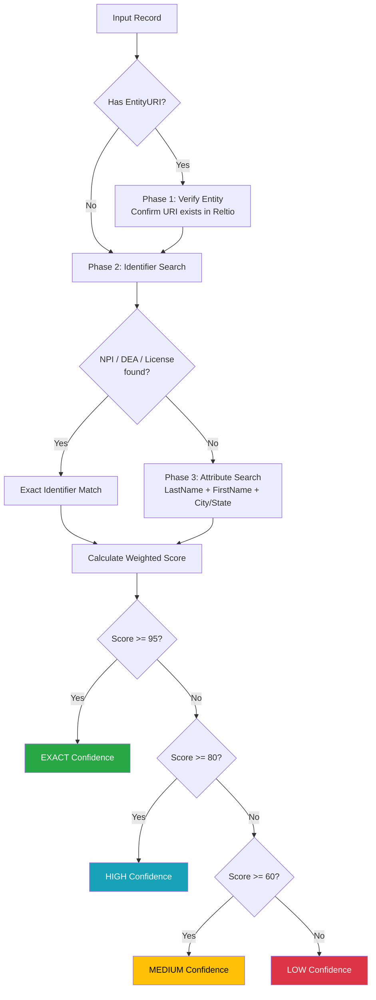

# Reltio Bulk Merge Agent

[](https://www.python.org/downloads/)
[](LICENSE)
[](https://streamlit.io/)
[](Dockerfile)

An AI-powered bulk match & merge agent for **Reltio MDM** (Master Data Management). Built for Data Stewards and MDM teams to identify, review, and merge duplicate entity records at scale with high throughput and configurable confidence thresholds.

> **Disclaimer:** This is an independent, community-built solution and is **not officially affiliated with or endorsed by Reltio, Inc.** It integrates with the Reltio platform via its public REST APIs.

---

## Table of Contents

- [Features](#features)
- [Architecture](#architecture)
- [How It Works](#how-it-works)
- [Integration Modes](#integration-modes)
- [Quick Start](#quick-start)
- [Usage](#usage)
  - [Web UI (Streamlit)](#web-ui-streamlit)
  - [CLI](#cli)
  - [Python API](#python-api)
- [Input File Format](#input-file-format)
- [Match Scoring Strategy](#match-scoring-strategy)
- [Configuration](#configuration)
- [Docker Deployment](#docker-deployment)
- [Testing](#testing)
- [Project Structure](#project-structure)
- [Contributing](#contributing)
- [License](#license)

---

## Features

| Feature | Description |
|---------|-------------|
| **Bulk File Processing** | Accepts CSV, Excel (.xlsx), and JSON files with automatic column mapping |
| **Multi-Strategy Matching** | Weighted scoring across NPI, DEA, name, address, specialty, and more |
| **AI-Enhanced Analysis** | Optional LLM integration (OpenAI/Claude) for intelligent match evaluation |
| **Confidence Scoring** | Four-tier classification: Exact, High, Medium, Low |
| **Dry-Run Mode** | Validate merge operations before executing them |
| **Concurrent Execution** | Async I/O with configurable concurrency (semaphore-controlled) |
| **Retry Logic** | Exponential backoff for transient API failures |
| **Three Interfaces** | Streamlit Web UI, CLI, and Python API |
| **Hybrid Integration** | Works via direct Reltio REST API or through Reltio MCP Server |
| **Export Reports** | JSON and CSV reports with full merge audit trail |

---

## Architecture



---

## How It Works



---

## Integration Modes

This agent supports a **hybrid architecture** — it can connect to Reltio in two ways:



| Mode | When to Use |
|------|-------------|
| **Direct API** (Default) | Standalone deployment, maximum performance, no additional infrastructure |
| **Via MCP Server** | When you already have Reltio MCP Server running, want unified tool access, or need activity logging through MCP |

---

## Quick Start

### 1. Clone & Install

```bash
git clone https://github.com/yadurajsingh96/reltio-bulk-merge-agent.git
cd reltio_bulk_merge_agent

python -m venv venv
source venv/bin/activate  # On Windows: venv\Scripts\activate

pip install -r requirements.txt
pip install -e .
```

### 2. Configure

```bash
cp .env.example .env
# Edit .env with your Reltio credentials
```

### 3. Verify Connection

```bash
python -m src.cli health
```

### 4. Run

```bash
# Web UI
streamlit run src/ui/streamlit_app.py

# CLI
python -m src.cli analyze --file sample_data/hcp_sample.csv

# Quick one-liner (analyze + auto-select + dry-run)
python -m src.cli analyze --file data.csv --auto-select --auto-threshold 90
```

---

## Usage

### Web UI (Streamlit)

```bash
streamlit run src/ui/streamlit_app.py
```

The web UI provides a guided 5-step workflow:

| Step | Action |
|------|--------|
| **1. Configure** | Enter Reltio credentials, select LLM provider, set thresholds |
| **2. Upload** | Upload CSV/Excel/JSON, preview data, verify column mapping |
| **3. Analyze** | Run match analysis with real-time progress bar |
| **4. Review** | Filter by confidence, inspect individual matches, bulk select/deselect |
| **5. Merge** | Dry-run validation, execute confirmed merges, download reports |

### CLI

```bash
# Health check
python -m src.cli health

# Analyze file
python -m src.cli analyze --file sample_data/hcp_sample.csv

# Analyze with options
python -m src.cli analyze \
  --file data.csv \
  --entity-type HCP \
  --auto-select \
  --auto-threshold 90 \
  --concurrency 10 \
  --csv \
  -v

# Execute merges (dry-run first!)
python -m src.cli merge --file analysis_report.json --dry-run
python -m src.cli merge --file analysis_report.json --confirm

# Convert report to CSV
python -m src.cli report --file analysis_report.json
```

### Python API

```python
from src.api import MergeAPI

# Initialize from environment variables
api = MergeAPI.from_env()

# Or explicit configuration
api = MergeAPI(
    client_id="...",
    client_secret="...",
    tenant_id="...",
    environment="dev",
    llm_api_key="sk-...",
    llm_provider="openai"
)

# Full workflow
session = api.analyze_file("hcp_records.csv", entity_type="HCP")
summary = api.get_summary(session)
api.auto_select(session, min_score=90)

# Dry run
result = api.execute_merges(session, dry_run=True)
print(f"Would merge: {result.successful}/{result.total_operations}")

# Execute
result = api.execute_merges(session, dry_run=False)
print(f"Merged: {result.successful}, Failed: {result.failed}")

# Export
api.export_json(session, "report.json")
api.export_csv(session, "report.csv")
```

#### One-Call Convenience

```python
result = api.quick_merge(
    "hcp_records.csv",
    entity_type="HCP",
    min_score=95,
    dry_run=True
)
```

---

## Input File Format

Accepts CSV, Excel (.xlsx/.xls), and JSON. Column names are auto-detected using 70+ common aliases.

### Supported Fields

| Standard Name | Example Aliases |
|---------------|----------------|
| NPI | npi, NPI_Number, national_provider_id |
| FirstName | first_name, First, given_name, fname |
| LastName | last_name, Last, surname, family_name |
| Specialty | specialty, primary_specialty, specialization |
| Address | address, street, address_line_1 |
| City | city, town |
| State | state, st, state_code, province |
| Zip | zip, zipcode, postal_code |
| Phone | phone, telephone, phone_number |
| DEA | dea, dea_number |
| EntityURI | entity_uri, reltio_uri (existing Reltio entity ID) |

### Sample CSV

```csv
NPI,FirstName,LastName,Specialty,City,State,EntityURI
1234567890,John,Smith,Cardiology,Boston,MA,entities/abc123
1234567891,Jane,Doe,Oncology,New York,NY,entities/def456
```

---

## Match Scoring Strategy

Records are matched using a 3-phase strategy:



### Attribute Weights

| Attribute | Weight | Rationale |
|-----------|--------|-----------|
| NPI | 100 | Unique national identifier |
| DEA | 90 | Unique DEA identifier |
| Medical License | 85 | State-level unique ID |
| Last Name | 60 | Primary name component |
| First Name | 50 | Secondary name component |
| Specialty | 40 | Professional classification |
| Address | 35 | Location indicator |
| Phone | 30 | Contact verification |
| City | 25 | Geographic grouping |
| State | 20 | Regional grouping |
| Zip | 15 | Postal area |

---

## Configuration

### Environment Variables

| Variable | Required | Default | Description |
|----------|----------|---------|-------------|
| `RELTIO_CLIENT_ID` | Yes | - | OAuth 2.0 Client ID |
| `RELTIO_CLIENT_SECRET` | Yes | - | OAuth 2.0 Client Secret |
| `RELTIO_TENANT_ID` | Yes | - | Reltio Tenant ID |
| `RELTIO_ENVIRONMENT` | Yes | `dev` | `dev`, `test`, `prod`, `prod-usg` |
| `OPENAI_API_KEY` | No | - | OpenAI API key for AI match analysis |
| `ANTHROPIC_API_KEY` | No | - | Anthropic API key for AI match analysis |
| `MCP_SERVER_URL` | No | - | Reltio MCP Server URL (for hybrid mode) |
| `ENTITY_TYPE` | No | `HCP` | Default entity type |
| `MAX_CONCURRENT` | No | `10` | Max concurrent API requests |
| `AUTO_MERGE_THRESHOLD` | No | `95` | Auto-merge score threshold |
| `REVIEW_THRESHOLD` | No | `70` | Review score threshold |

---

## Docker Deployment

### Using Docker Compose

```bash
# Build and start the Web UI
docker compose up -d --build

# Access at http://localhost:8501
```

### Using CLI via Docker

```bash
# Run analysis
docker compose run --rm cli analyze --file /app/sample_data/hcp_sample.csv

# Health check
docker compose run --rm cli health
```

### Standalone Docker

```bash
docker build -t reltio-bulk-merge-agent .
docker run -p 8501:8501 --env-file .env reltio-bulk-merge-agent
```

---

## Testing

```bash
# Run all tests
pytest tests/

# With coverage
pytest tests/ --cov=src --cov-report=term-missing

# Verbose
pytest tests/ -v
```

---

## Project Structure

```
reltio-bulk-merge-agent/
├── src/
│   ├── core/
│   │   ├── reltio_client.py      # Async Reltio API client (httpx, OAuth2, connection pooling)
│   │   ├── match_analyzer.py     # Multi-strategy matching + LLM scoring
│   │   ├── merge_executor.py     # Concurrent merge execution with retry logic
│   │   └── merge_assistant.py    # Main orchestrator (coordinates analyze → score → merge)
│   ├── parsers/
│   │   └── file_parser.py        # CSV/Excel/JSON parser with 70+ column alias mapping
│   ├── ui/
│   │   └── streamlit_app.py      # Web UI (5-step guided workflow)
│   ├── api/
│   │   └── merge_api.py          # Python API wrapper for programmatic access
│   └── cli.py                    # CLI interface (analyze, merge, health, report)
├── sample_data/                   # Sample CSV and JSON test files
├── tests/                         # Test suite
├── docs/                          # Documentation and diagrams
├── Dockerfile                     # Container image
├── docker-compose.yml             # Multi-service orchestration
├── pyproject.toml                 # Package configuration
├── requirements.txt               # Python dependencies
├── .env.example                   # Environment variable template
├── .gitignore
├── LICENSE                        # MIT License
└── README.md                      # This file
```

---

## Performance

| Metric | Detail |
|--------|--------|
| **I/O Model** | Async (httpx with connection pooling) |
| **Concurrency** | Configurable semaphore (default: 10 parallel requests) |
| **Retry** | Exponential backoff for transient failures |
| **Memory** | Streaming parser for large files |
| **Batch Size** | Controlled batch execution for merges |

---

## Contributing

Contributions are welcome! Please:

1. Fork the repository
2. Create a feature branch (`git checkout -b feature/my-feature`)
3. Commit your changes (`git commit -m 'Add my feature'`)
4. Push to the branch (`git push origin feature/my-feature`)
5. Open a Pull Request

---

## License

This project is licensed under the MIT License - see the [LICENSE](LICENSE) file for details.

---

## Acknowledgments

- [Reltio](https://www.reltio.com/) for their MDM platform and public REST APIs
- [Reltio MCP Server](https://github.com/reltio-ai/reltio-mcp-server) for the MCP protocol foundation
- [Streamlit](https://streamlit.io/) for the web framework
- [OpenAI](https://openai.com/) and [Anthropic](https://www.anthropic.com/) for LLM APIs

---

**Built by [Yaduraj Singh](https://github.com/yadurajsingh96)**
